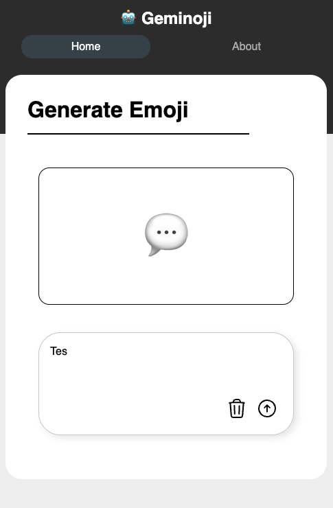

# Geminoji 🤖

A simple promting app that returns an Emoji based on the input text. 😜

## Backend GitHub Repo

https://github.com/llevasseur/gemini-101-api

# Installation

create .env based on .env.sample

npm i

npm run dev

## Screenshots

### Landing Page

### Typing Interaction

### Generated Response

